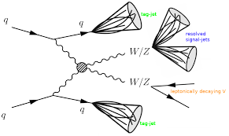

# VBS $W \pm W \pm$ Semileptonic Analysis with PocketCoffea

## Overview

This hands-on tutorial will guide you through performing a semileptonic **Vector Boson Scattering (VBS)** W±W± analysis using the [PocketCoffea](https://github.com/PocketCoffea) framework.

You will learn how to:

- Configure PocketCoffea for VBS Semileptonic Analysis.
- Select physics objects (jets, leptons, MET).
- Apply VBS-like preselections for the semileptonic channel (Central Jets, Forward Jets and Central Leptons).
- Reconstruct the hadronic and leptonic W boson and compute its kinematic variables.
- Make histograms and explore distributions.
  
------

## Physics Motivation

Vector Boson Scattering is a rare electroweak process where two vector bosons (here $W \pm W\pm$) are produced with two forward tagging jets. The semileptonic channel has:

- One **leptonic W** ($W \rightarrow l \mu$)  
- One **hadronic W** (W \rightarrow jj)  
- Two forward **VBS jets**  



Studying this process is essential for probing the Electroweak Symmetry Breaking (EWSB) mechanism and searching for deviations from the Standard Model.

---

## Setup Instructions

### 1. Environment
You can run this tutorial on **lxplus** or any system with Docker/Singularity support and PocketCoffea installed.

```bash
# Clone the tutorial repository
git clone https://github.com/wbuitrago/Pocket_Coffea_Tutorial.git
cd Tutorial_Pocket_VBS_semilep

# Proxy Grid
voms-proxy-init -voms cms -rfc --valid 168:0

# Open PocketCoffea in the singularity
apptainer shell -B /afs -B /cvmfs/cms.cern.ch \
                -B /tmp  -B /eos/cms/  -B /etc/sysconfig/ngbauth-submit \
                -B ${XDG_RUNTIME_DIR}  --env KRB5CCNAME="FILE:${XDG_RUNTIME_DIR}/krb5cc" \
    /cvmfs/unpacked.cern.ch/gitlab-registry.cern.ch/cms-analysis/general/pocketcoffea:lxplus-el9-stable

```

## 2. Datasets 

For this tutorial, we use two signal MC datasets:
* /WpWpJJ-EWK_TuneCP5_13p6TeV-powheg-pythia8/.../NANOAODSIM
* /WmWmJJ-EWK_TuneCP5_13p6TeV-powheg-pythia8/.../NANOAODSIM

**Exercise**:
Generate the json file for the  two MC samples.

Open Dataset-discovery-CLI

```bash
pocket-coffea dataset-discovery-cli
```

**Hint:** Key_words Datasets:
  * /WpWpJJ*/Run3*/NANOAODSIM - Dataset # 1 - XS = 0.02093
  * /WmWmJJ*/Run3*/NANOAODSIM - Dataset # 1 - XS = 0.007868
  
### Tutorial Structure:

We will work with three main scripts:

1. example_config_semileptonic.py
Configures PocketCoffea:
* Loads datasets and parameters
* Sets up skimming and preselections
* Defines histograms

2. custom_cut_functions.py
Defines:
* nLepton_skim_cut: requires ≥1 good lepton
* vbs_semileptonic_presel: VBS-like preselections

3. workflow.py
Implements VBSWWBaseProcessor:
* Applies object preselection
* Reconstructs VBS jets and hadronic W boson
* Computes helper variables for plotting

Hands-On plan

We will proceed step-by-step:

1. Load the configuration and inspect available datasets.
2. Run with a small subset (--limit-files 1 --limit-chunks 2) to check everything works.
* Use the `--test` flag with `pocket-coffea run`
3. Inspect histograms for:
* Number of jets
* MET
* mjj(VBS jets)
* mjj(W hadronic)
* Modify preselections:
* Change MET cut
* Change mjj(VBS) cut
* See how distributions change
4. Add new plots:
* $\Delta R$ between hadronic W jets
* $\eta$ distribution of leptons

```bash

# Run PocketCoffea Configuration 
pocket-coffea run --cfg example_config_semileptonic.py \
                  -o output_semilep \
                  -e futures \
                  --scaleout 4 \
                  --limit-files 1 \
                  --limit-chunks 2

# MakePlots
cd output_semilep
pocket-coffea make-plots -i output_all.coffea --cfg parameters_dump.yaml -o plots

```

### Troubleshooting

If you can't find files in your apptainer image, you may need to explicitly bind the local directory to the image:
```bash
apptainer shell -B $(pwd) -B /afs -B /cvmfs/cms.cern.ch \
                -B /tmp  -B /eos/cms/  -B /etc/sysconfig/ngbauth-submit \
                -B ${XDG_RUNTIME_DIR}  --env KRB5CCNAME="FILE:${XDG_RUNTIME_DIR}/krb5cc" \
    /cvmfs/unpacked.cern.ch/gitlab-registry.cern.ch/cms-analysis/general/pocketcoffea:lxplus-el9-stable
```

Using the `dask@lxplus` executor in the above apptainer image requires specifying that the worker node also uses the stable pocket coffea image:
```bash
pocket-coffea run --cfg example_config.py --executor dask@lxplus --scaleout 10 -o output_dask --worker-image /cvmfs/unpacked.cern.ch/gitlab-registry.cern.ch/cms-analysis/general/pocketcoffea:lxplus-el9-stable
```

### Documentation

The pocket-coffea GitHub repository is useful for finding documentation about various functions used through the exercise.
Try looking up in libraries based on the `import pocketcoffea.module.submodule` in the `pocket_coffea/lib` folder
[https://github.com/PocketCoffea/PocketCoffea/tree/main/pocket\_coffea](https://github.com/PocketCoffea/PocketCoffea/tree/main/pocket_coffea).

Defaults are usually stored in `.yaml` files in the repository, which are also useful to examine.

### Acknowledgements

Tutorial made by: Hayden Richard Hollenbeck & David Buitrago Ceballos
